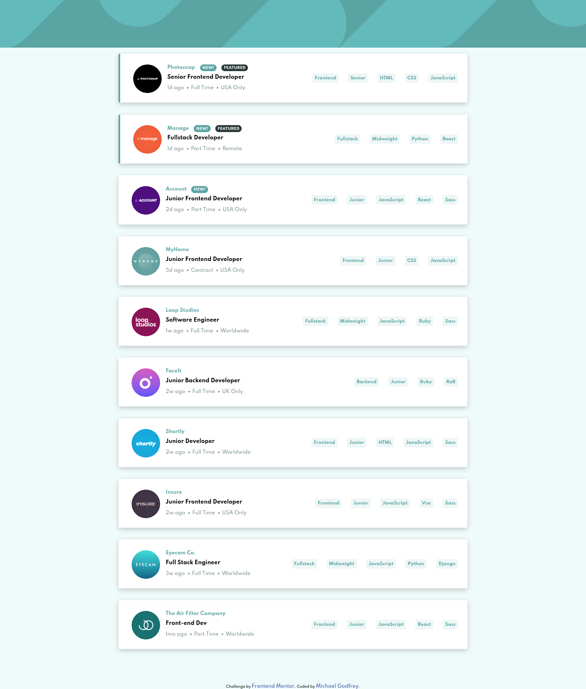
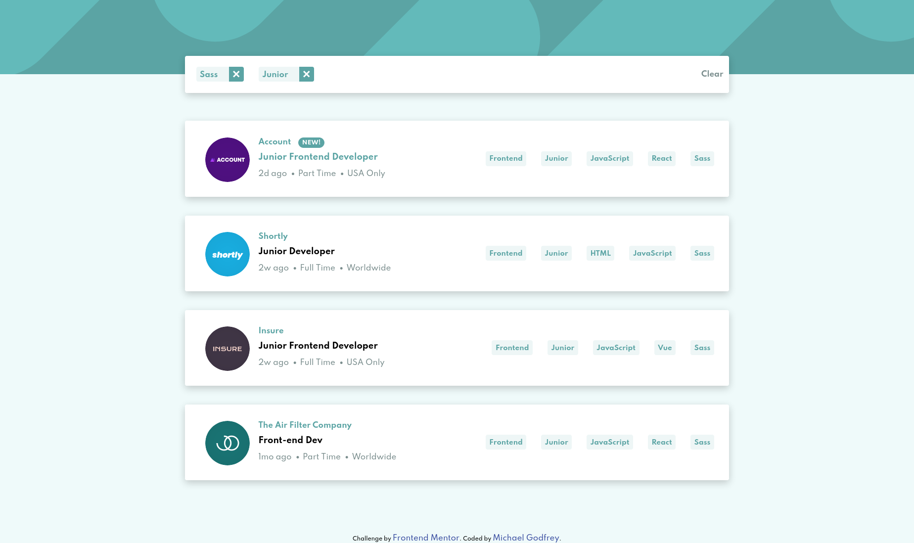

# Frontend Mentor - Job listings with filtering solution

## Welcome! 👋

Thanks for checking out this repository.

This is a solution to the [Job listings with filtering challenge on Frontend Mentor](https://www.frontendmentor.io/challenges/job-listings-with-filtering-ivstIPCt). Frontend Mentor challenges help you improve your coding skills by building realistic projects.

You can view this solution and others on my [Frontend Mentor solution page here](<https://www.frontendmentor.io/profile/michagodfrey>)

## Table of contents

- [Overview](#overview)
  - [The challenge](#the-challenge)
  - [Screenshot](#screenshot)
  - [Links](#links)
- [My process](#my-process)
  - [Built with](#built-with)
  - [What I learned](#what-i-learned)
  - [Continued development](#continued-development)
- [Author](#author)

## Overview

### The challenge

Users should be able to:

- View the optimal layout for the site depending on their device's screen size
- See hover states for all interactive elements on the page
- Filter job listings based on the categories

### Screenshot

Unfiltered list



Filtered list



### Links

- Solution URL: [Frontend Mentor](https://www.frontendmentor.io/solutions/jobs-listing-with-filtering-built-with-react-LMccYL0ca)
- Live Site URL: [GitHub Pages](https://michagodfrey.github.io/job-listings/)

## My process

### Built with

- Semantic HTML5 markup
- CSS custom properties
- Flexbox
- CSS Grid
- Mobile-first workflow
- [React](https://reactjs.org/) - JS library
- Some styles adapted from code generated by [styled-components.com](https://styled-components.com/)

### What I learned

Regarding styling, I have experimented with some new ways of selecting elements, such as .job > *, which selects all child elements of the .job element. I also attempted to follow BEM class naming method and have the job and filter components and blocks.

```css

.job {
  background-color: #fff;
  margin: 1.25rem 0;
  padding: 1rem;
  border-radius: var(--radius);
  box-shadow: var(--shadow);
}

.job--featured {
  border-left: 5px var(--clr-primary) solid;
}

@media (min-width: 768px) {

  .job {
    display: flex;
    align-content: center;
  }
}

.job > * {
  flex-basis: 100%;
}

.job__header {
  display: flex;
  flex-direction: column;
  margin-left: .5rem;
  max-width: 450px;
}

```

To be honest, I had a hard time getting the filter function to work. I was able to create a JavaScript function that would filter the data in a console, but couldn't implement that function in React. I didn't understand React well enough so I read up on the documentation and especially hooks to settle on a useEffect hook that runs every time the filter hook changed.

```js

useEffect(() => {
    let newJobList = [];
    data.forEach((job) => {
      let string = JSON.stringify(job);
      let count = 0;
      filter.forEach((item) => {
        if (string.includes(item)) {
          count++;
        }
      });
      if (count === filter.length) {
        newJobList.push(job);
      }
    });
    setJobs(newJobList);
  }, [filter]);
}

```

### Continued development

This has been great practice of React and I will continue to practice building things using the React library.

## Author

- Website - [Michael Godfrey](https://michagodfrey.github.io/)
- Frontend Mentor - [@michagodfrey](https://www.frontendmentor.io/profile/michagodfrey)
- Twitter - [@Michael07865192](https://twitter.com/Michael07865192)
